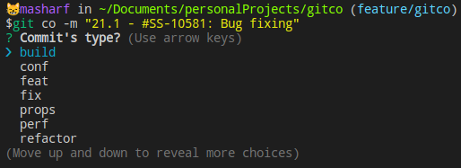

# gitco

Every commit has a type: {feature, bugFix, refactor,....}<br/>
You don't have to remember those types. 'gitco' will propose them to you in an elegant way 😉<br/>
And then inject the 'commit_type' where you want, according to a given pattern.<br/>

> A git command to "automate commit messages 'type' according to a given pattern"

## Available types

- build
- conf
- feat
- fix
- props
- perf
- refactor
- style
- docs
- test

> You can modify this list by editing: {DIR}/gitco/types_menu.js

# Demo



# Installation

## Step 1

Add the following lines to your shell configuration file like this:<br/>

> Note: Replace {DIR} with the absolute path of a directory of your choice.

### ~/.zshrc or ~/.bashrc
```
export gitco_dir="{DIR}/gitco"
export gitco_pattern="* - type:*" # Default="* - type: *"
export gitco_pattern_separator=":" # must appear in commit message, once and only once. Default=":"
PATH=$PATH:${gitco_dir}
```

Open a new terminal and run:<br/>

```
source ~/.zshrc
```

or

```
source ~/.bashrc
```

## Step 2

Run the folowing command to:<br/>
- Clone the project into a the desired directory '{DIR}'
- Give 'gitco' the required permissions
- Install related dependencies

```
sudo git clone https://github.com/MostafaACHRAF/gitco.git ${gitco_dir} \
&& sudo chmod +x ${gitco_dir}/git-co \
&& sudo chmod +x ${gitco_dir}/types_menu.js \
&& sudo chmod 777 ${gitco_dir}/cnf \
&& cd ${gitco_dir} && sudo npm i
```

# Dependencies

- node
- inquirer
- fs
- bash

# How it works?

1- Run 'gitco' without specifying the type:

```
git co {COMMIT_MESSAGE}
```

2- Choose the appropiate type from the list
3- The type will be injected where you specified it to be according to ${gitco_pattern}
4- Enjoy 🎉

#Configuration

You can customize where to insert 'commit_type'. There are three option:<br/>
1- In the begining
2- In the middle
3- In the end

> The default pattern is in the 'middle': * - type:*

You can change it into you shell config file:<br/>

```
export gitco_pattern=" * - type:*"
```

- The use of "type" and "*" is mandatory
- You can add any characters before or after "type"

### Begining pattern example
```
export gitco_pattern="type *"
```

### Middle pattern example
```
export gitco_pattern=" * - type:*"
```

- You must use a character after of before "type"
- You must indicate that character as a separator like this:

```
export gitco_pattern_separator=":" 
```

> The default separator is ":"
> This character must appear once and only once into you commit message

### End pattern example
```
export gitco_pattern="* type"
```
